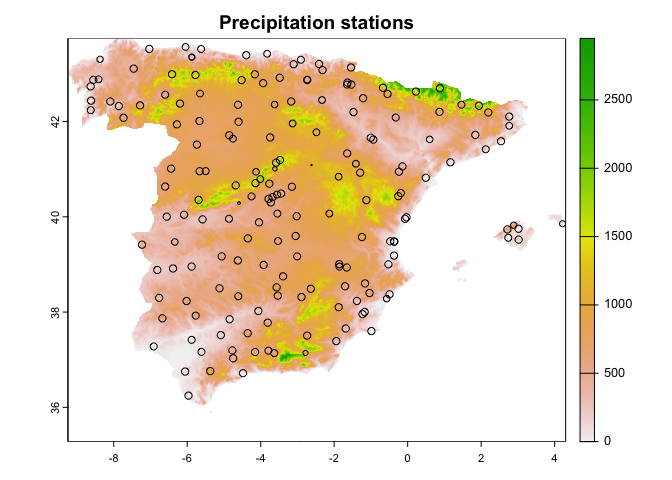
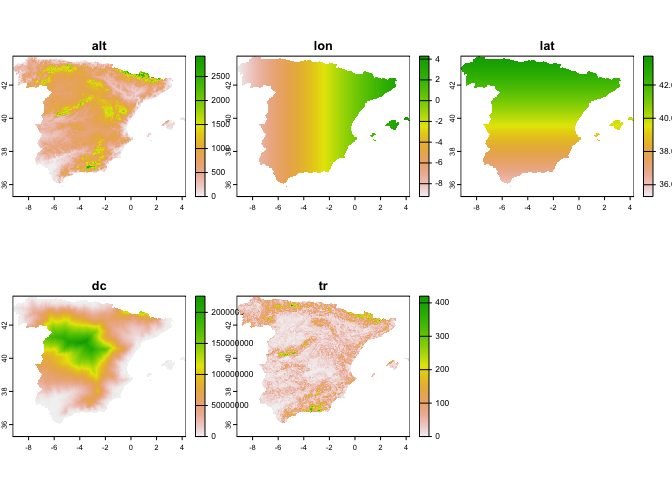
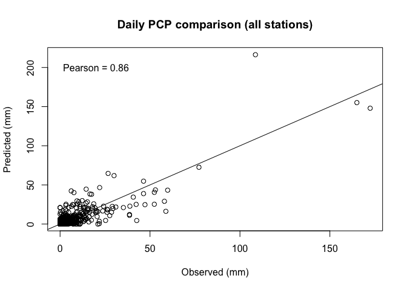
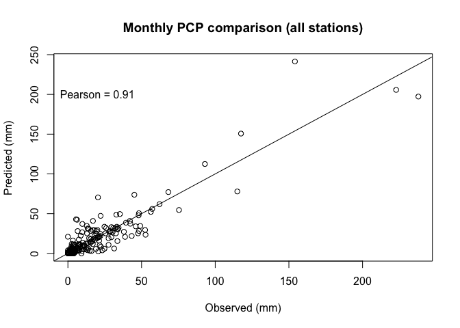
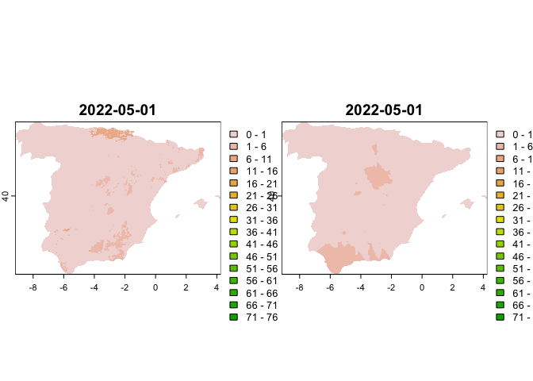
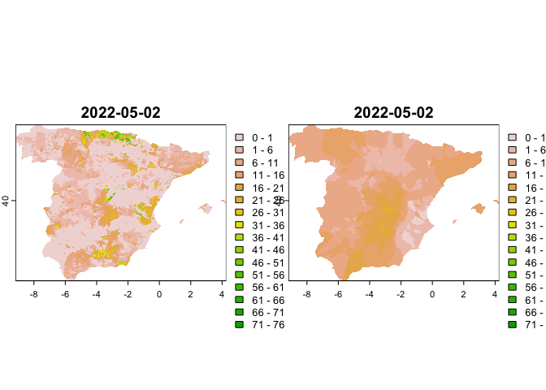

## Introduction to reddPrec

The goal of **reddPrec** is to perform a complete reconstruction of daily precipitation. The process follows 3 steps: 1) quality control of daily raw precipitation observations; 2) gap filling of missing values in data series; 3) creation of gridded datasets.

While here is provided a simple explanation about how to use the functions, a detailed explanation of the methodology can be found in: [Serrano-Notivoli et al., (2017)](https://doi.org/10.1016/j.envsoft.2016.11.005).

Each one of the three steps can be applied independently through the three available functions:

- **qcPrec()**: applies several threshold-based criteria to filter original observations of daily precipitation.
- **gapFilling()**: estimates new values for missing data in daily precipitation data series.
- **gridPcp()**: creates a gridded precipitation dataset from a station-based dataset of observations.

While the whole package is designed to work with daily precipitation, monthly and annual data can be addressed.


## Installation

Installation is straightforward since the package is available on CRAN:


```r
install.packages("reddPrec")
```

## Preparation of data

### Daily precipitation observations

We will use a set of daily precipitation observations from the Spanish Meterological Agency (AEMET) as example. 

The package [climaemet](https://ropenspain.github.io/climaemet/) facilitates the process of downloading the data, but you will need an API key from AEMET that can be freely obtained [here](https://opendata.aemet.es/centrodedescargas/altaUsuario?).


```r
library(climaemet)

# just replace "MY_API_KEY" by your personal API key and run this:
# aemet_api_key("MY_API_KEY", install=TRUE)

data_daily <- aemet_daily_clim(station = "all",
                               start = "2022-05-01", 
                               end = "2022-05-31",
                               return_sf = TRUE)
```

We only want to analyze the Iberian Peninsula and Balearic Islands, so we crop the spatial domain of the data with package [sf](https://r-spatial.github.io/sf/) using the boundaries of the Spanish regions (except Canary Islands) retrieved with package [giscoR](https://ropengov.github.io/giscoR/).


```r
library(sf)
library(giscoR)
spain <- gisco_get_nuts(country = "Spain", nuts_level = "2")
spain <- spain[-which(spain$NAME_LATN=='Canarias'),]
data_daily <- st_crop(data_daily, spain)
```

```
## Warning: attribute variables are assumed to be spatially constant throughout
## all geometries
```

The daily data must be organized in a single matrix with columns (stations) and rows (days). To do that, we use the [reshape](https://cran.r-project.org/web/packages/reshape/index.html) package which facilitates the task of *casting* data.


```r
library(reshape)
dd <- cbind(as.data.frame(data_daily),st_coordinates(data_daily))
obs_pr <- cast(dd[,c('fecha','indicativo','prec')], fecha~indicativo)
```

AEMET codes low precipitation data (*PCP<0.1*) as "Ip". As the function only accepts numeric values, we ensure that no strings remain.


```r
obs_pr <- apply(obs_pr, 2, function(x){
  x <- gsub(',','.',x)
  x[x=='Ip'] <- NA
  as.numeric(x)
})
```

Lastly, we create a data.frame with the information of the stations


```r
stations <- data.frame(ID=dd$indicativo, alt = dd$altitud, lon = dd$X, lat = dd$Y)
stations <- stations[-which(duplicated(stations$ID)),]
```

### Creation of geospatial (raster) data

Te estimation of precipitation is used in all stages of the reconstruction process, and it uses environmental data as predictors. As we don't have available this information for each station's location, it can be extracted from raster data, but must create it first.

In this case, we will use five predictors: 1) elevation, 2) latitude, 3) longitude, 4) distance to the coast (as a cost-distance function with elevation) and 5) TRI (Terrain Ruggedness Index).

First, we use the [elevatr](https://github.com/jhollist/elevatr) package to derive a raster of elevations. Then, the [terra](https://rspatial.org/pkg/index.html) package will allow for calculating the required environmental predictors derived from elevations.


```r
library(elevatr)
library(terra)
dem <- get_elev_raster(data_daily, z = 5)
dem <- crop(dem, spain)
dem <- mask(dem, spain)
dem[dem<0] <- 0
dem <- rast(dem)
dc <- costDist(dem)
tr <- terrain(dem, v = 'TRI')
```

Now we create the latitude and longitude rasters from the stations' information.


```r
lon <- rast(cbind(crds(dem),crds(dem)[,1]),type='xyz',crs='EPSG:4326')
lat <- rast(cbind(crds(dem),crds(dem)[,2]),type='xyz',crs='EPSG:4326')
```

Lastly, we extract the values of distance to the coast and TRI to the stations


```r
stations <- vect(stations, geom=c('lon','lat'),crs = 'EPSG:4326',keepgeom=TRUE)
stations$dc <- terra::extract(dc, stations)[,2]
stations$tr <- terra::extract(tr, stations)[,2]
stations <- as.data.frame(stations)
```

Those stations with no overlapping with raster don't have data, so we remove them


```r
stations <- stations[complete.cases(stations),]
obs_pr <- obs_pr[, match(stations$ID, colnames(obs_pr))]
```

At his point, we have available the dataset with the original data.


```r
st <- vect(stations, geom=c('lon','lat'),crs = 'EPSG:4326',keepgeom=TRUE)
st$ndata <- colSums(!is.na(obs_pr))*100/nrow(obs_pr)

plot(dem, main = "Precipitation stations")
plot(st, cex=st$ndata/100, pch = 1, add=T)
```

<!-- -->

And the environmental pedictors


```r
env <- c(dem, lon, lat, dc, tr)
names(env) <- c("alt","lon","lat","dc","tr")
plot(env)
```

<!-- -->

## Quality control

The quality control (QC) function allows for a customization of the thresholds applied to each criteria. In this case, we will flag and remove the observations based on the following conditionals:

- the coordinates (lon, lat) will be used as predictors
- the 10 nearest observations to estimate precipitation
- no maximum radius of searching nearest observations 
- we will apply the 5 reference QC criteria: suspect value, suspect zero, suspect outlier, suspect wet day and suspect dry day.
- a threshold of 10 times higher or lower observation than estimate to detect outliers
- a threshold of 0.99 wet probability and an observed magnitude higher than 5 mm to detect suspect zeros.
- a threshold of 0.01 wet probability and an observed magnitude lower than 0.1 mm to detect suspect values higher than 5 mm.
- two processor cores to compute results in parallel (usually the higher the faster, depending on your hardware capabilities)


```r
library(reddPrec)
qcdata <- qcPrec(prec = obs_pr, 
                 sts = stations, 
                 crs = 'EPSG:4326', coords = c('lon','lat'),
                 coords_as_preds = TRUE, neibs = 10, thres = NA,
                 qc = 'all', qc3 = 10, qc4 = c(0.99, 5), qc5 = c(0.01, 0.1, 5),
                 ncpu=2)
```

Depending on the velocity of your processor(s), the job will be done quick or slow, but this particular task (with our setting) should take a few minutes. If you use a large dataset of observations, the computing time rises. 

The result is a list of two elements:

- **cleaned**: a matrix (stations x days) with the filtered observations (cleaned data).
- **codes**: a matrix (stations x days) with the codes corresponding to the reasons of values removal 
  - "1" (suspect value): obs==0 & all(neibs>0)
  - "2" (suspect zero): obs>0 & all(neibs==0)
  - "3" (suspect outlier): obs is "qc3" times higher or lower than the estimate
  - "4" (suspect wet): obs==0 & wet probability > "qc4[1]" & estimate > "qc4[2]"
  - "5" (suspect dry): obs>"qc5[3]" & dry probability < "qc5[1]" & estimate < "qc5[2]")

In our particular example, the outliers (QC3) were the most flagged values (3.05%), followed by suspect values (QC1, 0.90%), suspect dry (QC5, 0.42%), suspect wet (QC4, 0.21%) and suspect zeros (QC2, 0.11%).


```r
allcodes <- as.numeric(as.matrix(qcdata$codes))
flagged <- round(table(allcodes)*100/length(allcodes),2)
flagged
```

```
## allcodes
##    1    2    3    4    5 
## 0.90 0.11 3.05 0.21 0.42
```

## Gap filling

Missing values are common in raw original data series of observations. After the QC process, the number of these missing data is increased, and the resulting gaps can affect to further analyses at coarser scales (seasonal, annual, etc.). To solve that, a large collection of infilling methods exist, most of them based on regression algorithms.

The gap filling process in **reddPrec** uses the nearest observations (a number defined by the user) and their associated environmental information (which we added to the *stations* data.frame in the "data preparation" section) to compute a Reference Value (RV). The RV is computed through a multivariate linear regression that uses all those data. 

The function returns a data.frame with different estimates for all days of every station:

- **wd_pred**: probability (0 to 1) of wet day
- **raw_pred**: rainfall prediction (in the original units) obtaind from the model
- **mod_pred**: modified prediction based on wet day probability (if wd_pred<0.5 -> mod_pred = 0)
- **st_pred**: standardized prediction (based on mod_pred) from selected standardization method (ratio or quantile)
- **err**: standard error of the model (in the original units)
- **neibs**: number of nearest stations (neighbors) used in the model. They can vary if a searching threshold (thres) is set.


```r
gf_res <- gapFilling(prec = qcdata$cleaned, 
                     sts = stations,
                     dates = seq.Date(as.Date('2022-05-01'), as.Date('2022-05-31'),
                                      by ='day'), 
                     stmethod = 'ratio', 
                     ncpu = 2, 
                     thres = NA, 
                     neibs = 10,
                     coords = c('lon','lat'),
                     crs = 'EPSG:4326',
                     coords_as_preds = TRUE,
                     window = 31)
```

```
## [2024-01-17 07:55:29.476654] - Filling gaps
```

```
## [2024-01-17 07:55:43.014059] - Standardizing final data series
```

```
## [2024-01-17 07:55:43.324543] - END
```


Our example doesn't show any difference between **mod_pred** and **st_pred** since we used a window of 31 days, which was the complete length of the dataset.

We can compare, for example, the original data series and their reconstructions.


```r
# daily

plot(gf_res$obs, gf_res$st_pred, xlab = 'Observed (mm)', ylab = 'Predicted (mm)', main = 'Daily PCP comparison (all stations)')
abline(0,1)
text(20,200, paste0('Pearson = ', round(cor(gf_res$obs, gf_res$st_pred, use="pairwise.complete.obs"),2)))
```

<!-- -->

```r
# monthly average (only considering days with observation)
obs <- gf_res[complete.cases(gf_res),]
o <- aggregate(obs$obs, by = list(obs$ID), FUN = sum)
p <- aggregate(obs$st_pred, by = list(obs$ID), FUN = sum)
plot(o[,2], p[,2], xlab = 'Observed (mm)', ylab = 'Predicted (mm)', main = 'Monthly PCP comparison (all stations)')
abline(0,1)
text(20,200, paste0('Pearson = ', round(cor(o[,2], p[,2], use="pairwise.complete.obs"),2)))
```

<!-- -->


## Gridding

The final step creates a gridded product based on the environmental variables in raster format. Different inputs can be used as observations: (i) the original observations or (ii) the reconstructed series. Reconstructed series are recommended due to the neighboring stations for all pixels will remain the same in all days of the period. Otherwise, some inconsistencies (inhomogeneities) could be imputed to the grid and spatially propagated.

We will use reconstructed series for our example, 15 neighbors with no radius limitation. Please consider that, although here the three steps (QC, gap filling and gridding) are presented as a workflow, they can be run separately, meaning that the options used in gridding can be different than gap fillin, for example.

The gridding process will take a long time depending on multiple factors: the grid resolution, the number of days, the number of neighbors, and the number of used CPUs, mainly. In our example, we will aggregate the grid at a coarser resolution and will reduce the time period to two days just to reduce the computing time. (This example takes about 3 minutes each day)


```r
rec <- data.frame(date = gf_res$date, ID = gf_res$ID, pred = gf_res$st_pred)
rec <- cast(rec, date~ID)
```

```
## Using pred as value column.  Use the value argument to cast to override this choice
```

```r
rec <- rec[,-1]

env2 <- terra::aggregate(env, 2)
rec2 <- rec[1:2,]

gridPcp(prec = rec2,
        grid = env2,
        sts = stations,
        dates = seq.Date(as.Date('2022-05-01'), as.Date('2022-05-02'),by ='day'),
        ncpu = 4,
        thres = NA,
        neibs = 15,
        coords = c('lon','lat'),
        crs = 'EPSG:4326',
        coords_as_preds = TRUE)
```

```
## [2024-01-17 07:55:43.461083] - Computing day 2022-05-01
```

```
## [2024-01-17 07:57:03.973424] - Computing day 2022-05-02
```

```
## [2024-01-17 07:58:23.712944] - END
```

The function creates 2 folders in the working directory, one containing the daily grids of precipitation estimates and one containing the daily grids of uncertainties (errors of the model)


```r
pre <- rast(list.files('./pred/', full.names = T))
err <- rast(list.files('./err/', full.names = T))

plot(c(pre[[1]],err[[1]]), breaks = c(0,seq(1,80,5)))
```

<!-- -->

```r
plot(c(pre[[2]],err[[2]]), breaks = c(0,seq(1,80,5)))
```

<!-- -->

